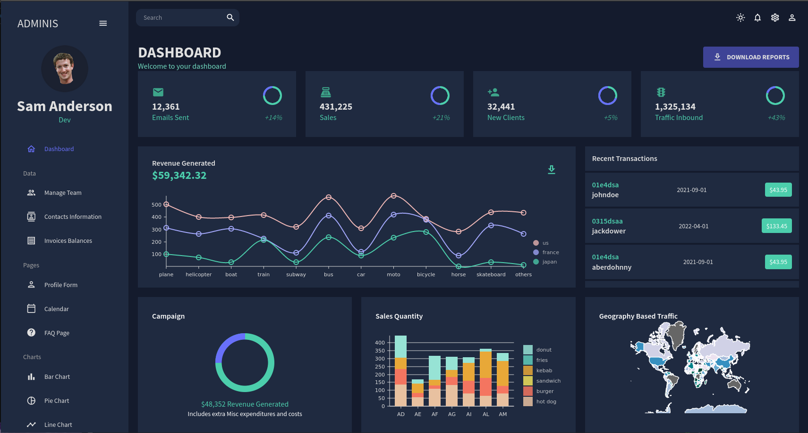
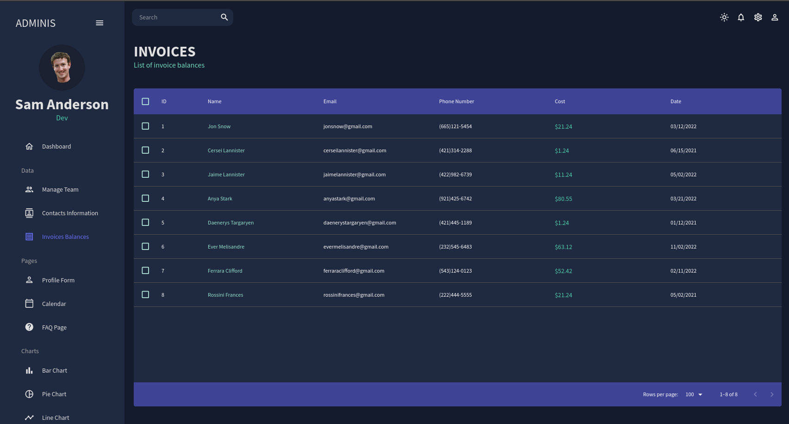
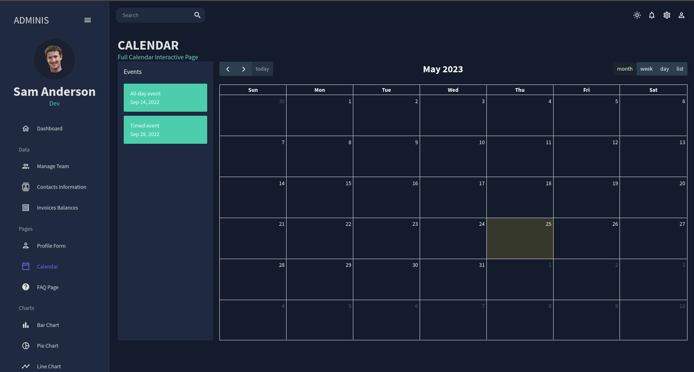
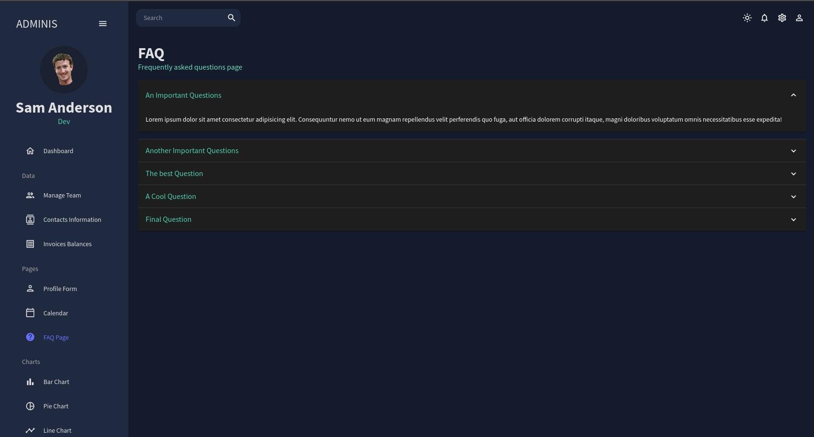
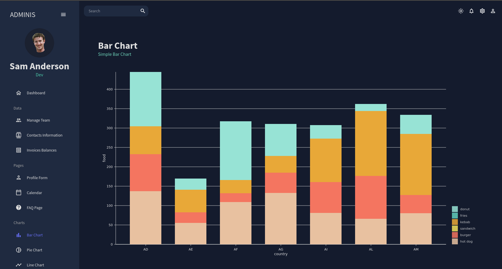
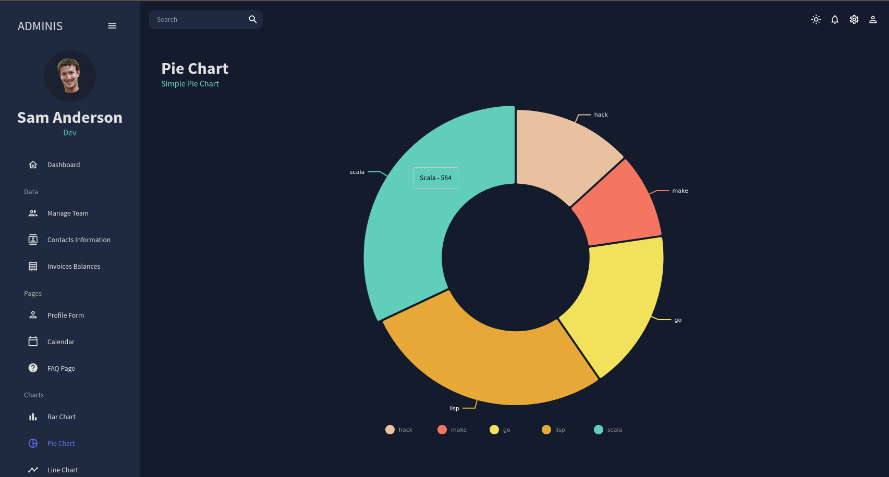
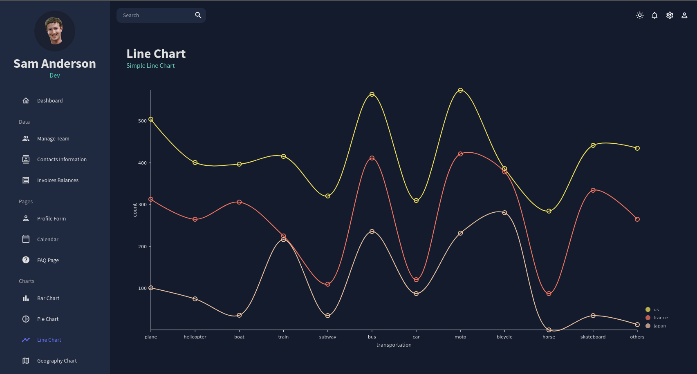
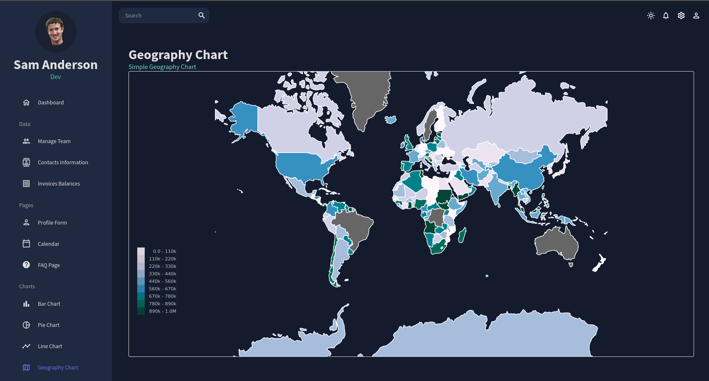

# Example Dashboard with charts, forms, tables

## Tools Used:

- Nivo
- NPM
- Material UI
- fullcalendar
- formik
- yup
- react-router-dom

## Main Dashboard

## Invoices

## Calendar

## FAQ Page

#### \* _All charts below made with Nivo_

[Nivo Website](https://nivo.rocks/)

## Bar Chart

## Pie chart

## Line Chart

## Geography Chart

